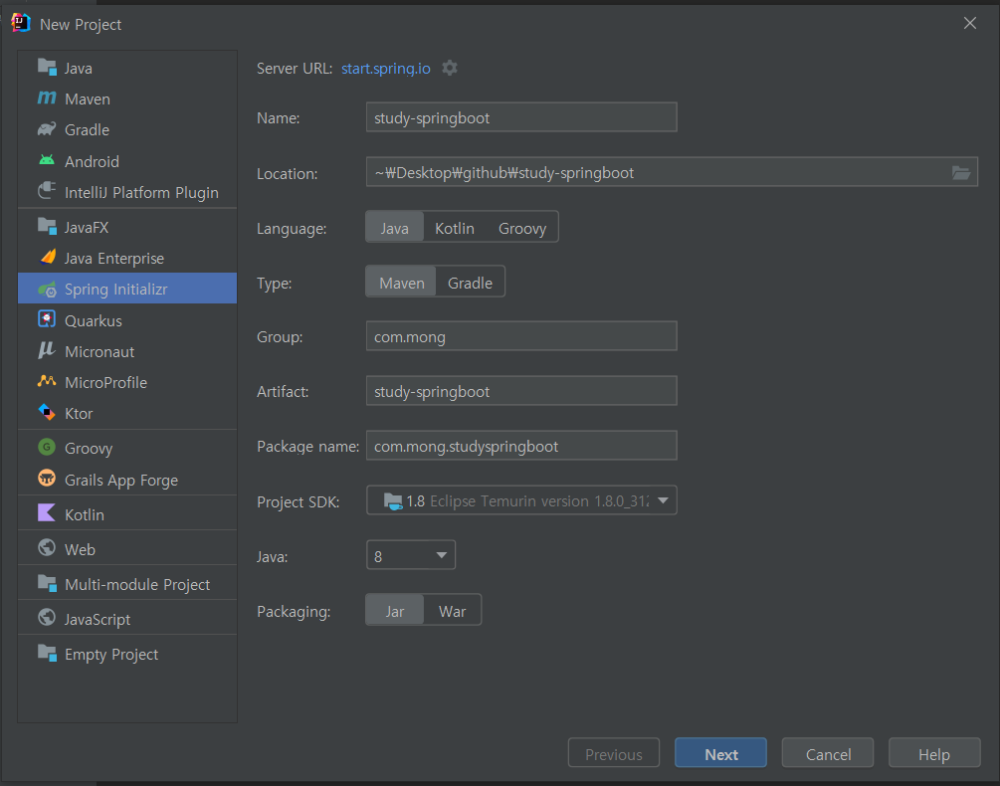
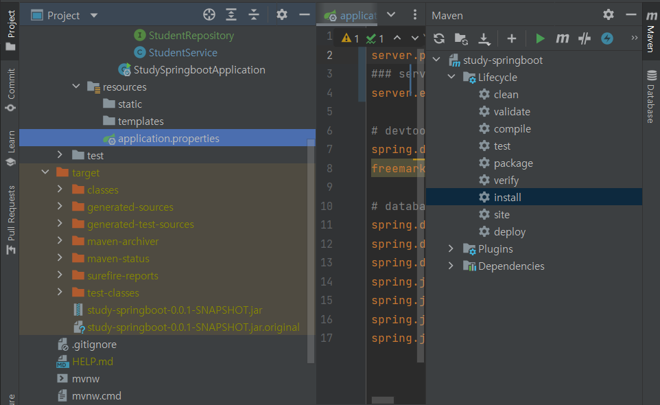

# Spring boot tutorial

* Intellij 사용
* Java 8

## Intellij 환경 구축

- 참고
    - [https://drcode-devblog.tistory.com/221](https://drcode-devblog.tistory.com/221)
- JDK 설치
    - [https://adoptopenjdk.net/](https://adoptopenjdk.net/)
    - JDK 8
- intellij 설치
- 프로젝트 만들기
    - spring initializr : [https://start.spring.io/](https://start.spring.io/)
    - intellij로 만들기
        - 설정

          

        - dependencies
            - Developer Tools
                - spring boot devtools : live reload
                    - 관련 설정 : [http://blog.engintruder.com/315](http://blog.engintruder.com/315)
                    - `compiler.automake.allow.when.app.running` 관련
                        - [https://youtrack.jetbrains.com/issue/IDEA-274903](https://youtrack.jetbrains.com/issue/IDEA-274903)
                - lombok : 인스턴스 변수의 Getter/Setter를 자동으로 추가
                - Spring Configuration Processor : 설정파일(yml등)에서 코드완성?
            - Web
                - Spring Web
- 플젝 중간에 dependency 변경
    - 방법
        - [https://dejavuhyo.github.io/posts/intellij-add-external-library/](https://dejavuhyo.github.io/posts/intellij-add-external-library/)
    - 적용
        - `pom.xml`에서 오른쪽 버튼 → `Maven` → `reload project`
- Intellij에서 API 검사
    - Controller에서 `@PostMapping` 옆의 지구 모양 클릭 → Generate Request in HTTP Client
    - `generated-request.http`

        ```jsx
        ###
        POST http://localhost:8081/api/v1/student
        Content-Type: application/json
        
        {
          "name": "toll",
          "email": "toll@gmail.com",
          "dob":"1955-07-31"
        }
        
        ###
        DELETE http://localhost:8081/api/v1/student/1
        
        ###
        PUT http://localhost:8081/api/v1/student/2?name=mm&email=mm@gmail.com
        Content-Type: application/json
        ```

- jar 만들기

    

- 오른쪽 세로로 있는 창에 `Maven` 누르면 프로젝트가 나오고, 그 하위에 3개의 폴더 나옴
    - 그 중 LifeCycle에 있는 `install` 클릭하면 `target` file이 생기고 `jar` 이 생긴다.
        - `clean` 은 기존의 `target`을 없애준다.
    - 실행

        ```powershell
        # target 폴더 밑에서 실행
        java -jar .\study-springboot-0.0.1-SNAPSHOT.jar
        
        ## 포트 충돌나는 경우
        java -jar .\study-springboot-0.0.1-SNAPSHOT.jar --server.port=8081
        ```


## DB (postgreSQL)

- postgres user로 접속

    ```sql
    psql -U postgres
    ```

- user

    ```sql
    # 생성
    create user students password 'students' superuser createdb;
    
    # 조회
    select * from pg_user;
    
    # 조회2 : 권한상세
    \du
    ```

- DB

    ```sql
    # 생성
    create database students;
    
    # 모든 DB 조회
    \l
    
    # db 소유주 변경
    ALTER DATABASE students OWNER TO students;
    
    # privileges 주기
    grant all privileges on database "students" to students;
    grant all privileges on database "students" to postgres;
    
    # DB 접속 : contactsDB에 contacts 유저 접속
    \c students students
    
    # DB 조회
    \d
    \d [schema name]
    ```


## Project

- 구조
    - src/main
        - java/com.mong.studyspringboot
            - [StudySpringbootApplication](./src/main/java/com/mong/studyspringboot/StudySpringbootApplication.java) : 어플리케이션 실행 부분
            - /student
                - [StudentController](./src/main/java/com/mong/studyspringboot/student/StudentController.java)
                - [StudentService](./src/main/java/com/mong/studyspringboot/student/StudentService.java)
                - [StudentRepository](./src/main/java/com/mong/studyspringboot/student/StudentRepository.java)
                - [Student](./src/main/java/com/mong/studyspringboot/student/Student.java)
                    - Entity
                        - student schema 관련
                        - 생성자 및 getter setter, toString
                - [StudentConfig](./src/main/java/com/mong/studyspringboot/student/StudentConfig.java)
                    - 여기서 사용한거는 그냥 서버 키자마자 테스트용 데이터 넣기 위함
        - resources
            - [application.properties](./src/main/resources/application.properties)
                - 모든 설정 가능(db 포함)
                - application.yml 로도 설정 가능 (이거 더 선호)

                ```properties
                # server
                server.port = 8081
                ### always show server error message
                server.error.include-message=always
                
                # devtools
                spring.devtools.livereload.enabled=true
                freemarker.cache=false
                
                # database
                spring.datasource.url=jdbc:postgresql://localhost:5432/students
                spring.datasource.username=students
                spring.datasource.password=students
                spring.jpa.hibernate.ddl-auto=create-drop
                spring.jpa.show-sql=true
                spring.jpa.properties.hibernate.dialect=org.hibernate.dialect.PostgreSQLDialect
                spring.jpa.properties.hibernate.format_sql=true
                ```

    - src/test
        - java/com.mong.studyspringboot
            - StudySpringbootApplicationTests : 모든 테스트 존재
    - target
        - `study-springboot-0.0.1-SNAPSHOT.jar` 존재
- annotation
    - `@Autowired` : 의존성 주입
        - ex

            ```java
            private final StudentService studentService;
            
            @Autowired
            public StudentController(StudentService studentService) {
                this.studentService = studentService; // new StudentService() 하면 의존성 높아짐
            }
            ```

    - Controller
        - `@RequestMapping(path = "api/v1/student")` : url mapping
        - `@RestController` : restful
            - `@GetMapping` , `@PostMapping`, `@DeleteMapping`, `@PutMapping`
                - path 주는법 : `@PathVariavle` 필요

                    ```java
                    @DeleteMapping(path = "{studentId}")
                    public void deleteStudent(@PathVariable("studentId") Long studentId) {
                        studentService.deleteStudent(studentId);
                    }
                    ```

        - Parameter
            - `@PathVariable` : request url에서 변수 오는 경우
                - ex : `@PathVariable("studentId") Long studentId`
            - `@RequestParam` : request에서 parameter로 오는 경우
                - option
                    - `required = false` : 안 필요한 경우 false 줄 수 있음
                - ex : `@RequestParam(required = false) String name`
            - `@RequestBody` : request 에서 body로 오는 경우
                - ex : `@RequestBody Student student`
    - Service
        - `@Service` : `@Component` (가장 기본적인 annotation) 에서 뭐가 더 추가되지는 않았지만, service layer인 경우 사용하기
        - `@Transactional` : DB 에 update, delete 등을 하는 경우, 가능한지 보고 가능하지 않으면 전체 roll-back 함
    - Repository
        - `@Repository`
        - `@Query` : JPA에서 주어지는 것 이외에 추가로 만드는 쿼리 한해서 사용
            - ex

                ```java
                @Query("SELECT s FROM Student s WHERE s.email = ?1")
                Optional<Student> findStudentByEmail(String email);
                ```

    - Entity
        - `@Entity` : hibernate용, DB와 연결위함
        - `@Table` : 실제 DB내의 테이블 매핑 위함
        - column
            - primary key
                - `@Id` : primary key
                - `@GeneratedValue`
                    - `stragegy` : 여러 방법이 존재
                        - `strategy = GenerationType.*SEQUENCE*`
                            - 시퀀스를 사용하겠다.
                            - `@SequenceGenerator` 필요함
                - `@SequenceGenerator`
                    - `allocationSize` : sequence 증가량
                - [https://yoonbing9.tistory.com/19](https://yoonbing9.tistory.com/19)
            - other column
                - `@Transient` : 칼럼 제외
                    - 비즈니스 로직상 필요하지만 DB에는 필요없는 것
    - Configuration
        - `@Configuration` : 설정 파일임을 명시, Bean 등록할 것임을 명시
            - 이게 있어줘야 `@Bean` 을 등록했을 때 싱글톤 유지가 됨
        - `@Bean`
            - Spring Framework의 IoC가 관리하는 객체
            - POJO : 가장 기본적인 형태


## 참고

[https://www.youtube.com/watch?v=9SGDpanrc8U](https://www.youtube.com/watch?v=9SGDpanrc8U)